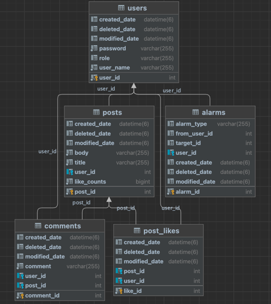

# MutsaSNS

url: ~~(http://ec2-43-200-70-107.ap-northeast-2.compute.amazonaws.com:8080/swagger-ui/)~~
---
### 참고자료

[Hibernate](https://docs.jboss.org/hibernate/orm/5.4/userguide/html_single/Hibernate_User_Guide.html)

---
### 체크리스트

✅ 회원가입 <br>
✅ Swagger <br>
✅ AWS EC2에 Docker 배포 <br>
✅ Gitlab CI & Crontab CD <br>
✅ 로그인 <br>
✅ 포스트 작성, 수정, 삭제, 리스트 <br>
✅ ADMIN 회원으로 등급업하는 기능 <br>
✅ ADMIN 회원이 일반 회원을 ADMIN으로 승격시키는 기능 <br>
✅ ADMIN 회원이 로그인 시 자신이 쓴 글이 아닌 글과 댓글에 수정, 삭제를 할 수 있는 기능 <br>
✅ 댓글 <br>
✅ 좋아요 <br>
✅ 마이피드 <br>
✅ 알림 <br>
☑️ 화면 UI 개발(차후 개발 예정) <br>

---
### 접근 방법 및 고민했던 부분

- [문제 해결 과정](https://github.com/JinDDung2/board/wiki/%EA%B3%A0%EB%AF%BC%EA%B3%BC-%EB%AC%B8%EC%A0%9C-%ED%95%B4%EA%B2%B0-%EA%B3%BC%EC%A0%95)
- hibernate 원서와 jpa에서 사용하는 애노테이션을 보며 디폴트 값과 사용방법을 공부하며 적용했습니다.
- 엔티티 값을 setter로 변경하는 것을 다음과 같은 이유로 지양했습니다.
  - @Setter는 사용 의도/목적이 분명치 않다. (Update인지 Create인지)
  - 무분별한 변경으로 객체의 일관성을 보장하기 어렵다. -> @Builder 패턴 적용
- Mock 프레임워크를 활용하여 기능 단위의 테스트로 컨트롤러 테스트와 서비스 테스트를 진행했습니다.
- 로깅을 적용할 시점을 런타임 시점에 적용해야 하는 것이 최선일까?
  - 컴파일 시점 로딩
  - 클래스 로딩 시점 로딩
  - 런타임 시점(사용한 방법)
    - 런타인 시점에 프록시 방식으로 스프링 AOP를 적용하다보니, 조인 포인트가 메서드 실행으로 제한되었다.
    - 그로 인해 생성자, static 메서드 그리고 필드 값은 로깅이 불가능하다.
- toEntity() 메서드가 다른 도미인에 의존해도 되는 것인가?
  - toEntity 메서드의 역할은 dto 객체를 Entity로 만드는 역할인데, CommentCreateRequestDto에서 toEntity(User user, Post post) 메서드를 두는 것은 유저 엔티티와 포스트 엔티티에 의존하게 된다.

---

### 아쉬운 점
- 테스트에 대한 기본지식 부족과 mock에 대한 지식 부족으로 인해 기능 테스트시간이 기능구현시간보다 적어도 3배이상 걸렸습니다.
- Thymeleaf 를 복습할 겸 화면 UI를 만들고자 했지만, 못만들어서 아쉽습니다.

---

### 관리자 아이디
```json
{
  "userName":"jin",
  "password":"jin"
} 
```

---

## 📔  Architecture(아키텍처) - Layered Architecture 구조


---

## DB설계


### users


### posts


### comments


### postLikes


### alarms


---

## ERD


---


